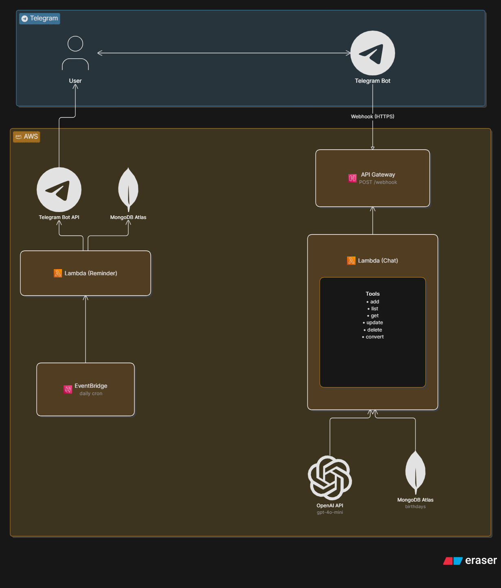

# Birthday Reminder Bot

A Telegram bot powered by OpenAI that helps you manage and get reminded about upcoming birthdays.

## Architecture



### Flow: Chat

1. User sends a message in Telegram (e.g. "Add Ali, 1 Ordibehesht")
2. Telegram forwards it to API Gateway via webhook
3. Chat Lambda receives the message, validates the user ID
4. Message is sent to OpenAI with tool definitions
5. OpenAI decides which tools to call (e.g. convert Shamsi → Miladi, then add)
6. Lambda executes the tools against MongoDB
7. OpenAI generates a human-friendly response
8. Lambda sends the response back via Telegram Bot API

### Flow: Daily Reminder

1. EventBridge triggers the Reminder Lambda every day at 8:00 AM UTC
2. Lambda queries MongoDB for birthdays in the next N days
3. Formats a reminder message and sends it to the user via Telegram

## Setup

1. Create a Telegram bot via [@BotFather](https://t.me/BotFather) and save the token
2. Get your Telegram user ID from [@userinfobot](https://t.me/userinfobot)
3. Get an [OpenAI API key](https://platform.openai.com/api-keys)
4. Set up a MongoDB instance ([Atlas free tier](https://www.mongodb.com/atlas) works)
5. Create an S3 bucket for Terraform state:
   ```bash
   aws s3api create-bucket --bucket your-bucket-name --region eu-central-1 \
     --create-bucket-configuration LocationConstraint=eu-central-1
   ```
6. Add the following secrets to your GitHub repository (Settings → Secrets → Actions):
   - `AWS_ACCESS_KEY_ID`
   - `AWS_SECRET_ACCESS_KEY`
   - `TELEGRAM_BOT_TOKEN`
   - `OPENAI_API_KEY`
   - `MONGODB_URI`
   - `ALLOWED_TELEGRAM_IDS`
7. Push to `master` — GitHub Actions will build and deploy automatically
8. Set the Telegram webhook (printed in the Terraform output):
   ```bash
   curl -X POST "https://api.telegram.org/bot<TOKEN>/setWebhook?url=<API_GATEWAY_URL>"
   ```

## Environment Variables

| Variable | Description |
|----------|-------------|
| `TELEGRAM_BOT_TOKEN` | Bot token from @BotFather |
| `OPENAI_API_KEY` | OpenAI API key |
| `MONGODB_URI` | MongoDB connection string |
| `ALLOWED_TELEGRAM_IDS` | Comma-separated list of allowed user IDs |
| `REMINDER_DAYS_AHEAD` | How many days before a birthday to remind (default: 3) |
